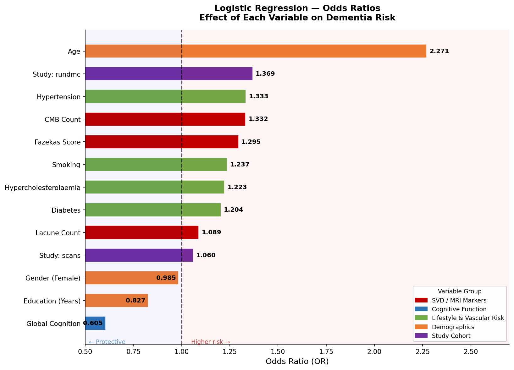
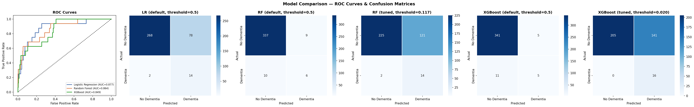
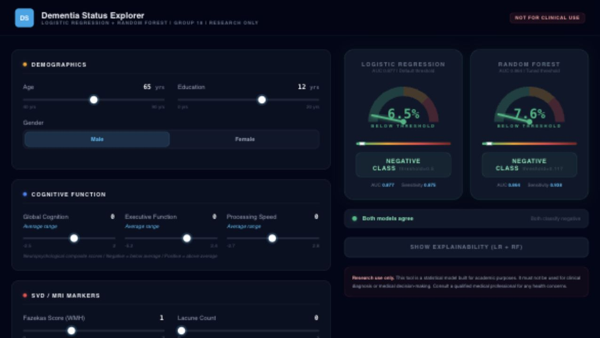

# Interpretable Dementia Status Classification

An end-to-end data modelling project that tests whether routinely collected
demographic, cognitive, vascular, and MRI variables can distinguish dementia
cases in a highly imbalanced multi-cohort dataset.

This was completed by a four-person university team. I served as team lead,
coordinating the analytical workflow, integrating the final deliverables, and
shaping the project narrative and presentation. This repository is the cleaned
portfolio version of the team submission.



## Project question

Dementia datasets create an easy trap: when only 4.5% of records are positive,
a model can appear highly accurate by predicting the majority class every time.
The useful question is therefore not "how high is the accuracy?" but:

> Can a model identify most dementia cases while remaining transparent enough
> to explain which variables drive its decisions?

The project used 1,842 records from three European cohorts. The source data
contains demographics, cognitive assessments, vascular risk factors, and MRI
markers associated with cerebral small vessel disease.

## Analytical approach

1. **Clean and harmonise the cohorts.** Redundant and high-missingness fields
   were removed, categorical variables were encoded, and remaining continuous
   gaps were median-imputed.
2. **Protect the evaluation.** The data was split before scaling and
   oversampling. `StandardScaler` was fitted on the training set only, and
   SMOTE was applied only to the training set.
3. **Design model-specific feature sets.** Logistic regression used the global
   cognition score without the strongly correlated EF and PS scores. Tree
   models retained all three cognitive measures.
4. **Compare simple and complex classifiers.** Logistic regression, random
   forest, and XGBoost were evaluated using AUC, sensitivity, specificity, and
   F1 rather than headline accuracy.
5. **Interpret the result.** Logistic regression odds ratios were compared with
   random forest feature importance and SHAP analysis.

## Results

| Model | Threshold | AUC | Sensitivity | Specificity | F1 |
|---|---:|---:|---:|---:|---:|
| Logistic Regression | 0.500 | **0.877** | 0.875 | 0.775 | 0.259 |
| Random Forest | 0.500 | 0.864 | 0.375 | 0.974 | 0.387 |
| Random Forest, tuned | 0.117 | 0.864 | **0.938** | 0.650 | 0.197 |
| XGBoost | 0.500 | 0.849 | 0.312 | **0.986** | 0.385 |

Logistic regression produced the strongest AUC and a practical balance between
sensitivity and specificity at the default threshold. In this dataset, the
simpler model generalised better and offered direct interpretation through odds
ratios.

The strongest logistic regression effects were:

- age: odds ratio 2.27 per standard deviation increase;
- global cognition: odds ratio 0.61, indicating a protective association;
- cohort membership, hypertension, cerebral microbleeds, and Fazekas score:
  smaller positive associations after controlling for the other variables.

These are statistical associations within this dataset, not causal effects or
clinical recommendations.



## Interactive prototype

The static browser prototype compares logistic regression with a tuned random
forest and shows feature-level explanations for a selected input profile.



Run it from the repository root:

```bash
python3 -m http.server 8000
```

Then open `http://localhost:8000/App/`.

The prototype is an academic demonstration. It is not a medical device and
must not be used for diagnosis or treatment decisions.

## Reproducing the analysis

1. Create a Python environment and install the dependencies:

   ```bash
   pip install -r requirements.txt
   ```

2. Download the
   [Dementia prediction dataset](https://www.kaggle.com/datasets/fatemehmehrparvar/dementia)
   and place `OPTIMAL_combined_3studies_6feb2020.csv` in `Data/`.
3. Run the notebooks in order:

   ```text
   1.Pre-processing.ipynb
   2.EDA.ipynb
   3.SMOTE.ipynb
   4.models.ipynb
   ```

Patient-level source and intermediate datasets are intentionally excluded from
the public repository. Aggregate results, figures, and exported model
parameters are retained for review.

## Repository structure

```text
App/                 Static explainable prediction prototype
Data/                Local dataset location; source data is not committed
Notebooks/           Ordered analysis workflow
Outputs/
  Figures/           EDA, evaluation, and interpretation plots
  Models/            Exported model parameters and random forest structure
  Results/           Aggregate statistical and model results
docs/                 Final team presentation
```

## Team context and my role

This was a four-person group project for a first-year BSc Data Science and
Statistics module.

As team lead, I was responsible for keeping the workstream coherent across
data preparation, modelling, interpretation, the interactive prototype, and
the final presentation. The modelling outputs and submitted deliverables were
shared team work; this repository presents them from my portfolio
perspective without claiming sole authorship.

## Limitations

- The task is cross-sectional classification of recorded dementia status, not
  prediction of future onset.
- Only 82 records were positive, so sensitivity estimates are based on a small
  test subset.
- All three cohorts are European; performance cannot be assumed to transfer to
  other populations.
- SMOTE creates synthetic training examples and may not represent uncommon
  clinical profiles.
- No prospective clinical validation or calibration study was performed.
